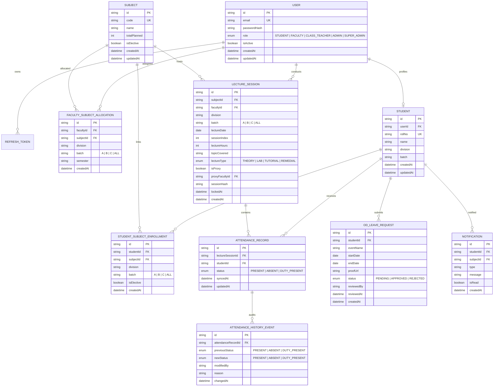

# OpenAttend — System Architecture & Database Schema

OpenAttend is a high-speed, full-fledged **Native Attendance ERP System** tailored for engineering colleges (specifically VESIT) to replace cumbersome Google Forms and manual spreadsheets.

---

## 🏗️ System Architecture Diagram

```mermaid
graph TD
    subgraph Onboarding Phase (Start of Semester)
        ClassTeacher[Class Teacher] -->|Uploads Master Excel Roster| ExcelParser[Excel Parser / Apache POI]
        ExcelParser -->|Extracts Students, Batches & Electives| PostgreSQL[(PostgreSQL Database)]
        Admin[HOD / Admin] -->|Allocates Subjects & Batches| AllocationService[Faculty Allocation Engine]
        AllocationService -->|Persists Teacher-Subject Mapping| PostgreSQL
    end

    subgraph Daily Attendance Marking Workflow
        Faculty[Subject Faculty / Lab Teacher] -->|Logs into Portal @ves.ac.in| FastMarkingUI[High-Speed Marking UI]
        FastMarkingUI -->|Taps Absentees in <10s| FastMarkingAPI[Fast Attendance Submission API]
        FastMarkingAPI -->|Natural-Key Hash & Atomic Batch| LectureSession[LectureSession & AttendanceRecords]
        LectureSession --> PostgreSQL
        LectureSession -->|Topic Covered Log| AcademicDiary[NAAC Academic Diary Tracker]
    end

    subgraph 48-Hour Audit & Correction Loop
        Faculty -->|Corrects Marking within 48h| CorrectionAPI[Correction Endpoint with Mandatory Reason]
        CorrectionAPI -->|Append Immutable Audit Event| HistoryEvents[attendance_history_events]
        HistoryEvents --> PostgreSQL
    end

    subgraph Student Experience & Alerts
        PostgreSQL -->|Reads Direct in <50ms| StudentAPI[REST Student API]
        StudentAPI -->|Live Dashboards| StudentPWA[Student PWA Dashboard - Rings & Safe Skips]
        LectureSession -->|Aggregates Drop Below 75%| DefaulterAlerts[7-Day Throttled Defaulter Alerts]
        DefaulterAlerts -->|Email / In-App| StudentPWA
    end

    subgraph Administrative & Accreditation Reporting
        PostgreSQL -->|Aggregated SQL Engine| DefaulterEngine[Defaulter Reporting Engine]
        DefaulterEngine -->|1-Click Notice Board Export| A4PDF[Printable A4 Defaulter PDF & Excel]
        PostgreSQL -->|Syllabus Metrics| DiaryReport[NAAC / NBA Course File Export]
    end
```

---

## 🗄️ Entity-Relationship (ER) Diagram



---

## 🛡️ Architectural Guarantees & Non-Negotiable Invariants

1. **High-Speed Marking UX (<10 Seconds)**:
   - Faculty mark **only absent students**; all others default to present.
   - Endpoint processes an entire division (up to 80 students) in `<100ms`.

2. **Strict Natural-Key Idempotency**:
   - Every attendance record is uniquely keyed by `(lecture_session_id, student_id)`.
   - Repeated submissions, multi-taps, or network retries are deduplicated via SHA-256 session hashing.

3. **48-Hour Academic Integrity Lock**:
   - Faculty can correct marking errors within 48 hours of lecture creation.
   - Every modification requires a mandatory explanation (`min 10 chars`) and generates an immutable audit record in `attendance_history_events`.
   - After 48 hours, the session is permanently locked.

4. **Institutional Security & RBAC Boundary**:
   - Accounts must match the `@ves.ac.in` domain.
   - Faculty can ONLY inspect rosters and submit attendance for classes allocated to them (`faculty_subject_allocations`). Unauthorized attempts are rejected with `403 Forbidden`.

5. **NAAC / NBA Accreditation Diary Integration**:
   - Every lecture submission records `topic_covered` and `lecture_type` directly in the database, automatically compiling real-time Course Diary syllabus progress metrics.
